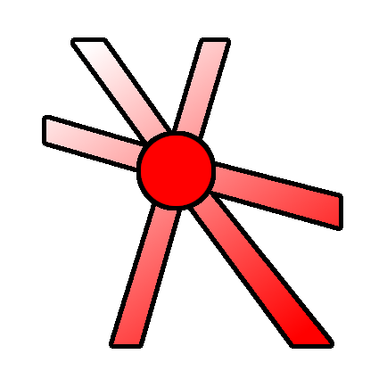

## godot-vertex-painter
 
**A simple tool to paint vertex colors on MeshInstance3Ds.**

[[Youtube Video](https://youtu.be/kPeYi7-9U6U)](https://www.youtube.com/watch?v=Qx7UtIk32i8)

---

https://github.com/bikemurt/godot-vertex-painter/assets/23486102/fea58b3f-8b71-48c5-840b-d1ae87ef0f7e

---

**Godot Versions Tested**
- v4.3.5 dev release
- v4.1.1

---
**V2.0: May 6, 2024**
- Paint directly on MeshInstance3Ds. StaticBodies are no longer required!
- This is thanks to an updated algorithm to find the 3D surface: https://twitter.com/_michaeljared/status/1787020920751579407
- Interface is improved
- Bucketfill is temporarily removed, let me know if you want this feature

---
## 🚀 Install & Use

1. Download this [repository](https://github.com/bikemurt/godot-vertex-painter/), or download from the [Godot Asset Library](https://godotengine.org/asset-library/asset/2470).
    - Import the addons folder into your project (if it already isn't present).
2. Activate the Vertex Painter addon under Project > Project Settings > Plugins. If an error dialog appears, restart the engine and try activating it again.
3. Add a MeshInstance3D to the scene which you wish to paint vertex colors]
4. Check "Enable Vertex Painting", click the MeshInstance3D, set the Color using the color picker, and start painting on screen

## ⚠️ Limitations

- Only imported meshes will work (or ArrayMesh, which have a clear_surfaces() method)
- Scale *must* be applied to meshes prior to trying to vertex paint them

## 🏠 Links

- [Homepage](https://www.michaeljared.ca/)
- [Youtube](https://www.youtube.com/@michaeljburt)
- [Blender Market](https://blendermarket.com/creators/michaeljared)

## 🗒️ License

[MIT License](/LICENSE)
